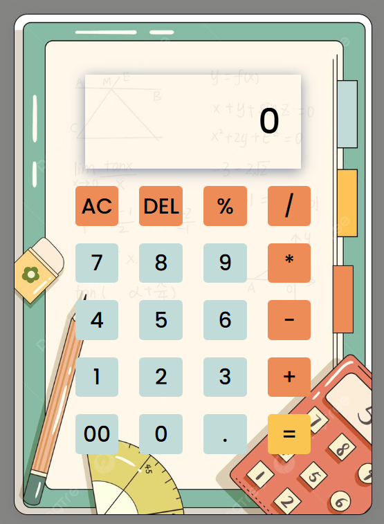

# Calculator

A simple web-based calculator built using HTML, CSS, and JavaScript.

## Features

- Basic arithmetic operations: Addition, Subtraction, Multiplication, and Division

- Percentage calculation

- Clear (AC) and Delete (DEL) functions

- Responsive and user-friendly interface

## Technologies Used

- **HTML**: Structure of the calculator

- **CSS**: Styling and layout of the calculator

- **JavaScript**: Functionality for performing calculations


## File Structure:

/Calculator<br>
│── index.html        # Main HTML file<br>
│── style.css         # Styling file<br>
│── script.js         # JavaScript logic for the game<br>
│── favicon.avif      # Game icon<br>
│── README.md         # Project documentation<br>
└── LICENSE           # MIT License file<br>


## How to Use

1. Open `index.html` in a web browser.

2. Click on the buttons to perform calculations.

3. Use `AC` to clear all input.

4. Use `DEL` to remove the last entered character.

5. Click `=` to get the result.

## Screenshots

 

## Setup

To run the project locally:

1. Clone the repository:
   ```bash
   git clone <https://github.com/saivarun0007/Calculator.git>
Open index.html in your browser.

2. Open index.html in your browser.


Credits:

Developed by CHANDRUPATLA SAI VARUN

License:

This project is licensed under the MIT License. Feel free to use and modify it!